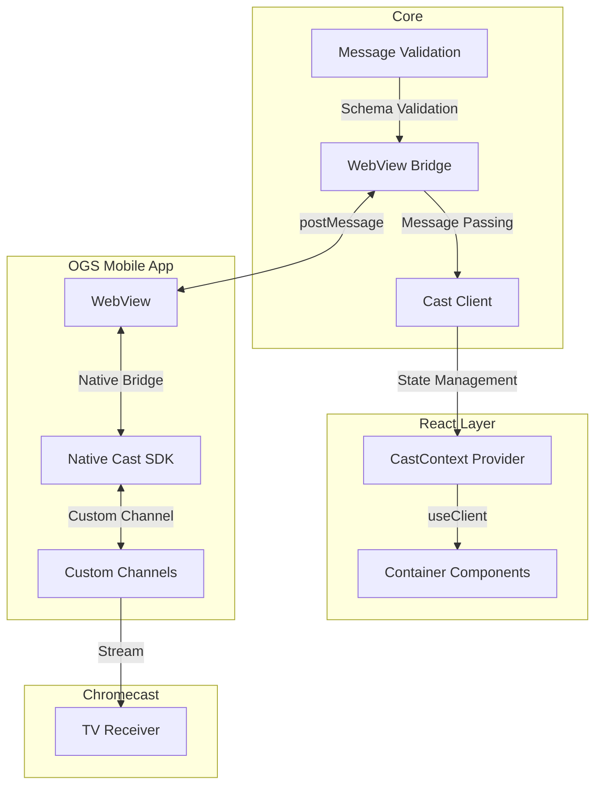

# 📺 Cast Kit

> Add TV casting to your web games with a headless state management approach

Cast Kit is a TypeScript library that enables TV casting capabilities for web games within the Open Game System (OGS) ecosystem. Following a headless approach that separates state from presentation, Cast Kit provides a clean, React-friendly API for interfacing with Chromecast functionality through the OGS app.

[](https://www.npmjs.com/package/@open-game-collective/cast-kit)
[](https://www.typescriptlang.org/)
[](LICENSE)

## 📚 Table of Contents

- [Installation](#installation)
- [Key Concepts](#key-concepts)
- [Architecture](#architecture)
- [Usage](#usage)
  - [Basic Setup](#basic-setup)
  - [Client Methods](#client-methods)
  - [Component Patterns](#component-patterns)
  - [Broadcast Page](#broadcast-page)
  - [Testing](#testing)
- [API Reference](#api-reference)
- [Examples](#examples)
- [FAQ](#faq)

## Installation

```bash
npm install @open-game-collective/cast-kit
# or
yarn add @open-game-collective/cast-kit
# or
pnpm add @open-game-collective/cast-kit
```

## Key Concepts

- **WebView Bridge**: Seamless communication between web game and native OGS app
- **Direct Client Access**: Simple client methods for casting operations
- **Headless Components**: Container components that provide data without UI opinions
- **Type Safety**: Full TypeScript support with Zod schema validation
- **Framework Agnostic Core**: Core client usable outside of React

## Architecture

Cast Kit operates across several layers to enable casting functionality:



## Usage

### Basic Setup

First, set up the provider in your app:

```jsx
// root.jsx or root.tsx
import { CastKitProvider, createCastClient } from '@open-game-collective/cast-kit';

export default function Root() {
  // Create a client instance
  const client = useMemo(() => createCastClient({
    debug: process.env.NODE_ENV !== 'production'
  }), []);
  
  return (
    <CastKitProvider client={client}>
      <App />
    </CastKitProvider>
  );
}
```

### Client Methods

Access the client directly to use casting functionality:

```jsx
// components/CastController.jsx
import { CastContext } from '@open-game-collective/cast-kit';

export function CastController({ gameId, roomCode, gameState }) {
  // Get direct access to the client
  const client = CastContext.useClient();
  
  // Use selector for optimized re-renders
  const isCasting = CastContext.useSelector(state => state.isCasting);
  
  // Signal game is ready to cast on mount
  useEffect(() => {
    client.signalReady({
      gameId,
      roomCode,
      broadcastUrl: `https://yourgame.com/cast?gameId=${gameId}&roomCode=${roomCode}`
    });
  }, [client, gameId, roomCode]);
  
  // Sync game state when changes occur
  useEffect(() => {
    if (isCasting && gameState) {
      client.sendStateUpdate(gameState);
    }
  }, [client, isCasting, gameState]);
  
  // Start casting to a device
  const handleStartCasting = (deviceId) => {
    client.startCasting(deviceId);
  };
  
  // Stop the current casting session
  const handleStopCasting = () => {
    client.stopCasting();
  };
  
  return null; // This is a controller component with no UI
}

// components/CastButton.jsx
export function CastButton() {
  // Get direct access to the client
  const client = CastContext.useClient();
  
  // Use selectors for state
  const isCasting = CastContext.useSelector(state => state.isCasting);
  const deviceName = CastContext.useSelector(state => state.deviceName);
  
  if (isCasting) {
    return (
      <button onClick={() => client.stopCasting()}>
        Stop Casting from {deviceName}
      </button>
    );
  }
  
  return (
    <button onClick={() => setShowDevices(true)}>
      Cast to TV
    </button>
  );
}
```

### Component Patterns

Cast Kit provides container components that make casting data available:

```jsx
// Using container components
import { CastContext } from '@open-game-collective/cast-kit';
import { useState } from 'react';

function CastingUI() {
  const [showDevices, setShowDevices] = useState(false);
  const client = CastContext.useClient();
  
  // Get casting state
  const isCasting = CastContext.useSelector(state => state.isCasting);
  const deviceName = CastContext.useSelector(state => state.deviceName);
  
  return (
    <div className="casting-interface">
      {/* Cast button */}
      <button 
        className={isCasting ? 'cast-button-active' : 'cast-button'}
        onClick={isCasting ? () => client.stopCasting() : () => setShowDevices(true)}
      >
        {isCasting ? `Casting to ${deviceName}` : 'Cast to TV'}
      </button>
      
      {/* Device selector */}
      {showDevices && (
        <DeviceSelectorModal onClose={() => setShowDevices(false)} />
      )}
      
      {/* Status indicator */}
      <CastContext.Status>
        {({ isCasting, deviceName, error }) => (
          <div className="cast-status">
            {isCasting && <div>Currently casting to {deviceName}</div>}
            {error && (
              <div className="error">
                Error: {error.message}
                <button onClick={() => client.resetError()}>Dismiss</button>
              </div>
            )}
          </div>
        )}
      </CastContext.Status>
    </div>
  );
}

function DeviceSelectorModal({ onClose }) {
  const client = CastContext.useClient();
  
  return (
    <div className="modal">
      <div className="modal-header">
        <h2>Cast to TV</h2>
        <button onClick={onClose}>×</button>
      </div>
      
      <div className="modal-body">
        <CastContext.Devices>
          {({ devices, isScanning }) => (
            <>
              <button onClick={() => client.scanForDevices()}>
                {isScanning ? 'Scanning...' : 'Scan for Devices'}
              </button>
              
              {devices.length === 0 && (
                <div className="empty-message">
                  {isScanning ? 'Scanning for devices...' : 'No devices found'}
                </div>
              )}
            </>
          )}
        </CastContext.Devices>
      </div>
    </div>
  );
}
```

### Conditional Rendering

Use container components for conditional rendering:

```jsx
// Conditional rendering based on cast state
function GameUI() {
  return (
    <div className="game-ui">
      {/* Render different UI based on cast state */}
      <CastContext.When casting={true}>
        <div className="casting-mode">
          <span>📺</span> Now casting - use your TV as display
        </div>
      </CastContext.When>
      
      <CastContext.When casting={false}>
        <GameControls />
      </CastContext.When>
      
      {/* Switch based on different states */}
      <CastContext.Switch>
        <CastContext.Case condition={state => state.isConnecting}>
          <ConnectingOverlay />
        </CastContext.Case>
        <CastContext.Case condition={state => state.error !== null}>
          <ErrorDisplay />
        </CastContext.Case>
        <CastContext.Default>
          <StandardGameUI />
        </CastContext.Default>
      </CastContext.Switch>
    </div>
  );
}
```

### Broadcast Page

Create a TV-optimized broadcast page for your game:

```jsx
// pages/cast.jsx
import React, { useState } from 'react';
import { useCastReceiver } from '@open-game-collective/cast-kit/receiver';

export default function CastPage() {
  const { gameId, roomCode } = useQueryParams();
  const [gameState, setGameState] = useState(null);
  
  // Connect to cast session
  const { isConnected, isConnecting, error } = useCastReceiver({
    onStateUpdate: (newState) => {
      setGameState(newState);
    }
  });
  
  // Loading states
  if (isConnecting) {
    return <div className="loading">Connecting to cast session...</div>;
  }
  
  if (error) {
    return <div className="error">Error: {error.message}</div>;
  }
  
  if (!isConnected || !gameState) {
    return <div className="loading">Waiting for game data...</div>;
  }
  
  // Render TV-optimized view
  return (
    <div className="tv-display">
      <GameBoardTV gameState={gameState} />
    </div>
  );
}
```

### Testing

Cast Kit provides tools for testing your casting components:

```jsx
// CastButton.test.jsx
import { render, screen, fireEvent } from '@testing-library/react';
import { CastKitProvider, createMockCastClient } from '@open-game-collective/cast-kit/test';
import { CastButton } from './CastButton';

describe('CastButton', () => {
  it('shows "Cast to TV" when not casting', () => {
    // Create mock client with initial state
    const mockClient = createMockCastClient({
      initialState: {
        isCasting: false,
        deviceName: null
      }
    });
    
    render(
      <CastKitProvider client={mockClient}>
        <CastButton />
      </CastKitProvider>
    );
    
    expect(screen.getByRole('button')).toHaveTextContent('Cast to TV');
  });
  
  it('calls stopCasting when clicked while casting', () => {
    const mockClient = createMockCastClient({
      initialState: {
        isCasting: true,
        deviceName: 'Living Room TV'
      }
    });
    
    // Spy on the client method
    jest.spyOn(mockClient, 'stopCasting');
    
    render(
      <CastKitProvider client={mockClient}>
        <CastButton />
      </CastKitProvider>
    );
    
    // Click the button
    fireEvent.click(screen.getByRole('button'));
    
    // Verify the method was called
    expect(mockClient.stopCasting).toHaveBeenCalled();
  });
});
```

## API Reference

### Core API

#### `createCastClient(options)`

Creates a client for managing cast operations.

```typescript
const client = createCastClient({
  debug?: boolean;
  initialState?: Partial<CastState>;
});
```

#### Client Methods

```typescript
interface CastClient {
  // State management
  getState(): CastState;
  subscribe(listener: (state: CastState) => void): () => void;
  
  // Core casting operations
  signalReady(params: { 
    gameId: string; 
    roomCode: string; 
    broadcastUrl?: string 
  }): void;
  startCasting(deviceId: string): void;
  stopCasting(): void;
  sendStateUpdate(state: Record<string, any>): void;
  
  // Device management
  getDevices(): CastDevice[];
  scanForDevices(): void;
  stopScan(): void;
  
  // Error handling
  resetError(): void;
}
```

#### `createCastContext()`

Creates a React context for accessing cast functionality.

```typescript
const CastContext = createCastContext();

// Available properties and components:
CastContext.Provider          // Context provider
CastContext.useClient()       // Access client instance directly
CastContext.useSelector()     // Select state with memoization 

// Container components:
CastContext.Status            // Provides cast status information
CastContext.Devices           // Provides device listing
CastContext.When              // Conditional rendering based on cast state
CastContext.Switch            // Switch between different cast states
CastContext.Case              // Case for Switch component
CastContext.Default           // Default case for Switch component
```

### State Interfaces

```typescript
// State interface
interface CastState {
  isCasting: boolean;         // Whether currently casting
  isConnecting: boolean;      // Whether connecting to a device
  deviceName: string | null;  // Name of the current cast device
  deviceId: string | null;    // ID of the current cast device
  sessionId: string | null;   // Current cast session ID
  error: Error | null;        // Any casting error
  devices: CastDevice[];      // Available cast devices
  isScanning: boolean;        // Whether currently scanning for devices
}

// Device interface
interface CastDevice {
  id: string;                 // Device ID
  name: string;               // Display name
  type: string;               // Device type
  isConnected: boolean;       // Whether currently connected
}
```

### Container Components

```typescript
// Status component
<CastContext.Status>
  {(status: { 
    isCasting: boolean; 
    deviceName: string | null;
    isConnecting: boolean;
    error: Error | null 
  }) => ReactNode}
</CastContext.Status>

// Devices component
<CastContext.Devices>
  {(devices: { 
    devices: CastDevice[];
    isScanning: boolean;
    error: string | null;
  }) => ReactNode}
</CastContext.Devices>

// When component
<CastContext.When 
  casting: boolean | ((state: CastState) => boolean)
>
  {children}
</CastContext.When>

// Switch and Case components
<CastContext.Switch>
  <CastContext.Case condition={(state: CastState) => boolean}>
    {children}
  </CastContext.Case>
  <CastContext.Default>
    {children}
  </CastContext.Default>
</CastContext.Switch>
```

### Testing API

```typescript
// Create a mock client
const mockClient = createMockCastClient({
  initialState?: Partial<CastState>;
});

// Mock client additional methods
mockClient.setState(partialState);        // Update mock state
mockClient.getMethodCalls(methodName);    // Get history of method calls
mockClient.clearMethodCalls();            // Clear method call history
```

## Examples

### Trivia Jam Integration

Here's how Trivia Jam integrates Cast Kit:

```jsx
// TriviaJam.jsx
import React, { useState, useEffect } from 'react';
import { CastKitProvider, CastContext, createCastClient } from '@open-game-collective/cast-kit';

function TriviaJamGame({ gameId, roomCode, gameState }) {
  const [showDeviceSelector, setShowDeviceSelector] = useState(false);
  const client = CastContext.useClient();
  const isCasting = CastContext.useSelector(state => state.isCasting);
  const deviceName = CastContext.useSelector(state => state.deviceName);
  
  // Signal game is ready when component mounts
  useEffect(() => {
    client.signalReady({
      gameId,
      roomCode,
      broadcastUrl: `https://triviajam.tv/games/${gameId}/cast?roomCode=${roomCode}`
    });
  }, [client, gameId, roomCode]);
  
  // Send state updates when game state changes
  useEffect(() => {
    if (isCasting && gameState) {
      client.sendStateUpdate(gameState);
    }
  }, [client, isCasting, gameState]);
  
  return (
    <div className="trivia-game">
      <header>
        <h1>Trivia Jam</h1>
        
        {/* Custom cast button */}
        <button 
          className={`cast-button ${isCasting ? 'active' : ''}`}
          onClick={isCasting ? () => client.stopCasting() : () => setShowDeviceSelector(true)}
        >
          {isCasting ? `Casting to ${deviceName}` : 'Cast to TV'}
        </button>
      </header>
      
      {/* Game content */}
      <main>
        <CastContext.When casting={false}>
          <QuestionDisplay question={gameState.currentQuestion} />
        </CastContext.When>
        
        <CastContext.When casting={true}>
          <ControllerView />
        </CastContext.When>
      </main>
      
      {/* Device selector modal */}
      {showDeviceSelector && (
        <DeviceSelectorModal onClose={() => setShowDeviceSelector(false)} />
      )}
    </div>
  );
}

function DeviceSelectorModal({ onClose }) {
  const client = CastContext.useClient();
  
  return (
    <div className="modal">
      <div className="modal-content">
        <div className="modal-header">
          <h2>Cast to TV</h2>
          <button onClick={onClose}>×</button>
        </div>
        
        <CastContext.Devices>
          {({ devices, isScanning }) => (
            <div className="device-list">
              <button className="scan-button" onClick={client.scanForDevices}>
                {isScanning ? 'Scanning...' : 'Scan for TVs'}
              </button>
              
              <ul>
                {devices.map(device => (
                  <li key={device.id}>
                    <button 
                      onClick={() => {
                        client.startCasting(device.id);
                        onClose();
                      }}
                    >
                      {device.name}
                    </button>
                  </li>
                ))}
                
                {devices.length === 0 && (
                  <li className="empty-message">
                    {isScanning 
                      ? 'Looking for TVs...' 
                      : 'No TVs found'
                    }
                  </li>
                )}
              </ul>
            </div>
          )}
        </CastContext.Devices>
      </div>
    </div>
  );
}

export default function TriviaJamApp() {
  // Create client once
  const [client] = useState(() => createCastClient());
  
  return (
    <CastKitProvider client={client}>
      <TriviaJamGame 
        gameId="trivia-123"
        roomCode="ABCD"
        gameState={/* game state */}
      />
    </CastKitProvider>
  );
}
```

## Direct Client Usage (Without React)

For non-React applications or advanced use cases, you can use the client directly:

```javascript
import { createCastClient } from '@open-game-collective/cast-kit/core';

// Create a client
const client = createCastClient();

// Signal game is ready to cast
client.signalReady({
  gameId: 'game-123',
  roomCode: 'ABC123',
  broadcastUrl: 'https://yourgame.com/cast?roomCode=ABC123'
});

// Listen for state changes
const unsubscribe = client.subscribe(state => {
  console.log('Cast state updated:', state);
  
  // Update UI based on state
  if (state.isCasting) {
    showCastingUI(state.deviceName);
  } else {
    showNormalUI();
  }
});

// Scan for devices
document.getElementById('scan-button').addEventListener('click', () => {
  client.scanForDevices();
});

// Update device list when devices change
client.subscribe(state => {
  const deviceList = document.getElementById('device-list');
  deviceList.innerHTML = '';
  
  state.devices.forEach(device => {
    const item = document.createElement('li');
    const button = document.createElement('button');
    button.textContent = device.name;
    button.addEventListener('click', () => {
      client.startCasting(device.id);
    });
    item.appendChild(button);
    deviceList.appendChild(item);
  });
});

// Send game state updates
function updateGameState(newState) {
  if (client.getState().isCasting) {
    client.sendStateUpdate(newState);
  }
}

// Clean up when done
function cleanup() {
  unsubscribe();
}
```

## FAQ

### Do I need to implement Chromecast SDK?

No. The OGS mobile app handles all Chromecast SDK integration. You only need to use Cast Kit's client methods to interface with this functionality.

### How do I create custom UI for casting?

Cast Kit doesn't provide any UI components - just container components that expose data. Use the client methods and state data to build UI components that match your game's design.

### Can I use Cast Kit outside of React?

Yes. While the React context provides convenient integration, you can use the core client directly in any JavaScript framework or vanilla JS.

### What happens during local development?

During development outside the OGS app, Cast Kit operates in mock mode. It simulates the casting experience without requiring an actual OGS app or Chromecast device.

### How does the communication work?

Cast Kit handles communication between:
1. Your web game and the OGS app via WebView postMessage
2. The OGS app and Chromecast via the Google Cast SDK

The client methods abstract this communication layer, providing a simple API for your game.

## Support and Resources

- **Documentation**: [Complete API Reference](https://docs.opengamecollective.com/cast-kit)
- **Examples**: [Example Integration on GitHub](https://github.com/open-game-collective/cast-kit-examples)
- **Discord Community**: [Join Discord](https://discord.gg/opengamecollective)
- **Support**: [support@opengame.org](mailto:support@opengame.org)

## License

Cast Kit is licensed under the MIT License - see the [LICENSE](LICENSE) file for details.

---

Built with ❤️ by the [Open Game Collective](https://github.com/open-game-collective)
